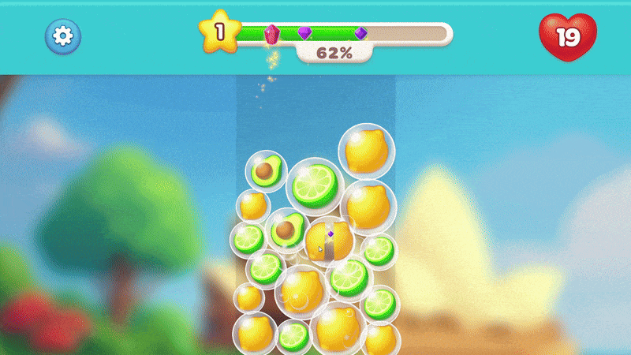
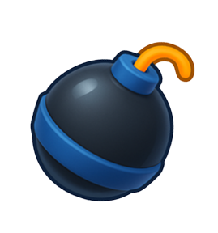
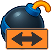
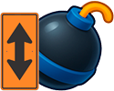
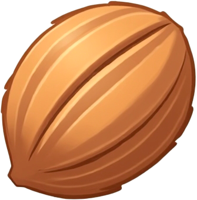

# Fruit Blast

## Правила
- Чтобы взорвать пузырь с фруктом, нужно чтобы его касалось ещё 2 таких же пузыря
- За взрыв пузыря отнимается жизнь. Если жизни закончатся - игра закончится. Как далеко ты сможешь зайти?
- Каждый взрыв пузыря заполняет шкалу сверху, за её заполнение вам даётся случайный перк
## Перки
| Название | Иконка | Описание |
| --- | --- | --- |
| Бомба |  | Взрывает пузыри в своём радиусе. С каждым уровнем радиус растёс |
| Горизонтальная бомба |  | Взрывает пузыри по горизонтали. С каждым уровнем дальность растёс |
| Вертикальная бомба |  | Взрывает пузыри по вертикали. С каждым уровнем дальность растёс |
| Быстрый палец |  | Появляется специальный пузырь, за взрыв которого некоторое время жизни не тратятся. С каждым уровнем растёт шанс появления такого пузыря и время действия способности |
| Счастливчик |  | Взрыв пузыря с некоторым шансом может дать вдое больше очков. С каждым уровнем шанс растёт |
| Крепкий орешек |  | Взрыв пузыря с некоторым шансом может не потратить жизнь. С каждым уровнем шанс растёт |
## Техническая информация
Версия Unity: 2022.3.45f1

Интерфейс адаптирован как под мобильные устройства, так и под компьютерные мониторы 
